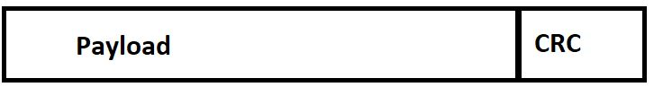
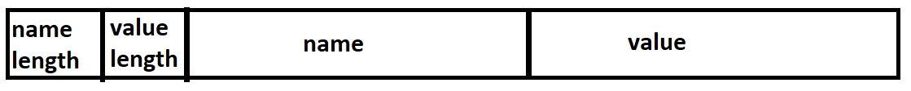

# Layered Network
This is an implementation of a layered network, facilitating half-duplex communications between two peers, a sender and a receiver.

## Layer 1: Single Byte
At the lowest level, the communication is done via UNIX pipe. This layer simply provides an interface to read a single byte to STDIN and write a single byte to STDOUT.

```c
int l1_write(char b);
```
Writes the byte specified by b. Returns 1 (true) on success or 0 (false) on error.

```c
int l1_read(char* b);
```
Reads one byte and copies the byte to the address specified by b. Returns 1 (true) on
success or 0 (false) on error.

## Layer 2: Messages
Layer 2 provides the ability to send and receive a message. A message is simply a sequence of bytes with a particular format.


As visually depicted in the image above, layer 2 attaches a header that contains a single `uint16_t` field in network byte order that indicates the length in bytes of the payload.

As per the specifications of this project, one important assumption we make at layer 2 is that the message or **payload** of the message (excluding the header) cannot be longer than 1024 bytes. Thus, ```l2_write``` and ```l2_read``` will return -1 if this condition is not met.

### Layer 2 Functions

```c
int l2_write(char* buffer, int length);
```
Sends a message consisting of the sequence of bytes starting at the address in buffer and having length length. Returns length on success or -1 on an error

```c
int l2_read(char* buffer, int maxLength);
```
Reads a message and stores it at the address specified by buffer. No more than maxlength bytes will be put into memory. If a message received by l2_read would require more than maxLength bytes, l2_read return -1. Upon successful reception of a message, the size of the message (the number of bytes actually stored in buffer) is returned.

## Layer 3: Messages with Error Detection
Layer 3 adds error detection to the services provided by layer 2. The service interface for layer 3 looks the same as the layer 2 service interface, but the layer 3 read also return a -1 if it detects an error in the received message.

We choose to use a Cyclic Redundancy Check or CRC to detect errors in messages. We use CRC-32, the error detection system used in modern Ethernet, with 0x04C11DB7 as the normal polynomial and the CRC table optimization technique to improve efficiency. Furthermore, our implementation of CRC has some key differences compared to Ethernet CRC-32:
- Firstly, the initial value for CRC that we use is **0**, instead of **0xFFFFFFFF**. 
- Secondly, the final XOR value is again **0**, instead of **0xFFFFFFFF**. 
- Lastly, our implementation of CRC does not reflect the input and results.



As visually represented above, we see that the CRC field that we calculate, which is of a fixed length, is appended to the end of the payload by layer 3.

### Further resources:
- Resources for the CRC calculation technique that we use:
    - https://en.wikipedia.org/wiki/Cyclic_redundancy_check
    - http://www.sunshine2k.de/articles/coding/crc/understanding_crc.html#ch6
    - https://barrgroup.com/embedded-systems/how-to/crc-calculation-c-code
- For CRC testing:
    - http://www.sunshine2k.de/coding/javascript/crc/crc_js.html

### Layer 3 Functions

```c
int l3_write(char* buffer, int length);
```
Sends a message that consists of the sequence of bytes starting at the address specified by buffer and having length length. Returns length on success or -1 on error.

```c
int l3_read(char* buffer, int maxLength);
```
Reads a message and stores it starting at the address specified by buffer. No more than maxLength bytes will be put into memory. If a message is received by l3_read that would require more than maxLength bytes, l3_read return -1. If some errors are detected in the message, l3_read return -1. Upon successful reception of a message, the size of the message (the number of bytes stored in buffer) is returned.

## Layer 4: Name/Value Pairs
Layer 4 provides a mechanism for sending and receiving values that have an associated name.



In a similar fashion to layer 2, layer 4 attaches a header with two `uint16_t` fields again in network byte order, where the first field records the length in bytes of the name buffer, and the second field, the length in bytes of the value buffer.

### Layer 4 Functions

```c
int l4 write(char *name, int nameLength, char *value, int valueLength)
```
Sends the (name, value) pair to the receiver, where nameLength specifies the number of bytes in name, and valueLength specifies the number of bytes in value. Returns 1 (true) on success or 0 (false) on error.

```c
int l4 read(char* name, int* nameLength, char* value, int* valueLength)
```
The l4 read function reads a (name, value) pair into the buffers pointed to by name and value. The nameLength and valueLength parameters are in/out parameters. On input to the function call, the integers should contain the maximum sizes of their respective buffers. On successful return from the function call, the integers hold the actual byte counts received in their respective buffers. The return value of l4 read is 1 (true) on success or 0 (false) on error, including the case where the name buffer or the value buffer would overflow.

# Usage
1. Clone this repo.
2. ```cd``` into the repo, then type the command ```make all```. 
3. Now the `peer` executable file should have been built. 
4. The `peer` program can be either a sender or a receiver. The command line arguments are used to determine which, with the sender processing arguments for the values of a username and password. The layer 1 functions communicate over stdin/stdout, so we can  connect a sender and receiver by having the shell set up a pipe between them, as follows (assuming the generated executable is named `peer`:

```bash
./peer <username> <password> | ./peer
```

## Testing
- Use `make test` to compile the unit tests and run `./test`.